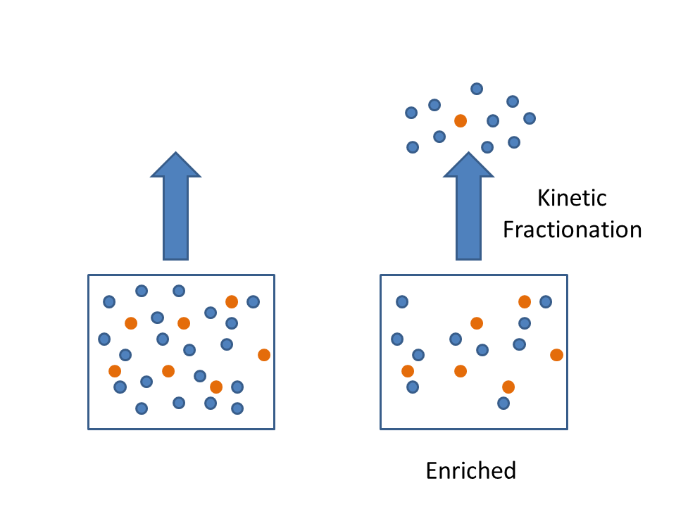
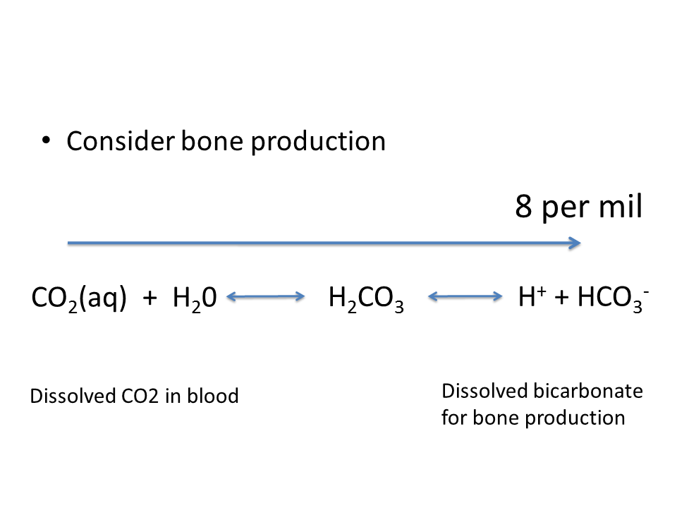
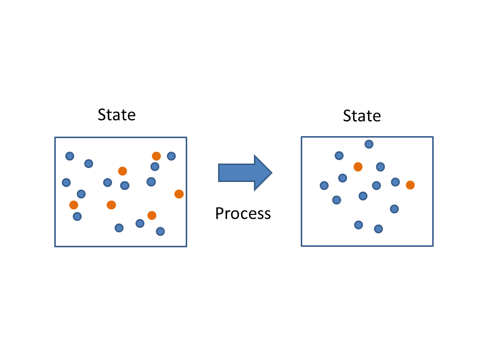
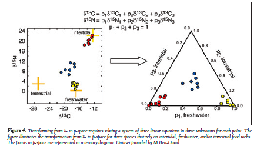
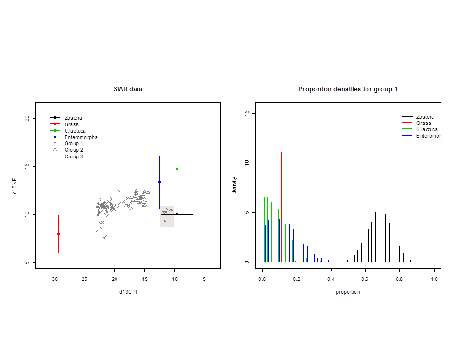
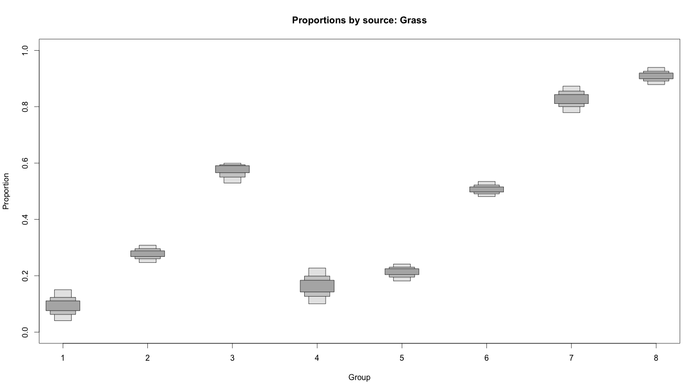
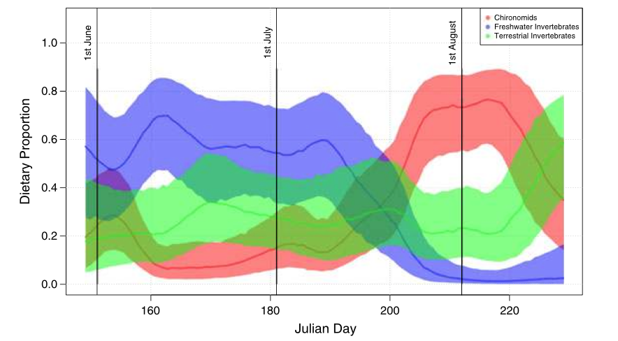
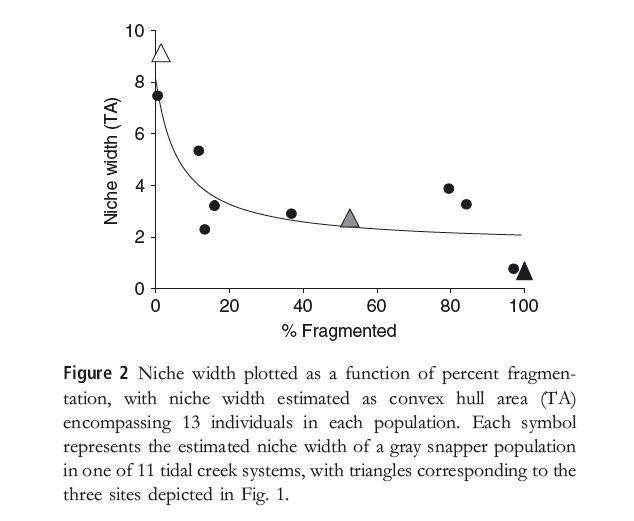

## General pattern for this course
- 09:15 - 10:00 Lecture
- 10:00 - 10:45 Discussion
- 10:45 - 11:30 Lecture
- 11:30 - 12:00 Discussion
- 12:00 - 12:45 Lecture
- 12:45 - 14:00 Lunch
- 14:00 - 15:30 Practical
- 15:30 - 16:00 Break
- 16:00 - 17:30 Discussion

## Questions ecologists often ask

> - What is this aniimal eating?
> - Are these animals specialists or generalists?
> - Why are these populations of animals eating different things?
> - How is this community functioning?

## Isotopes can provide insights

## Moving heavy isotopes is hard work

## Heavy isotopes are chemically sticky

## Observe the states and infer the process

## Ecological process inferred by isotopes
- Newsome, Martinez del Rio, Bearhop & Phillips. 2007. A Niche for Isotopic Ecology. Frontiers in Ecology and the Environment. 
- d-space and p-space

## Mixing Models move from d- to p-space
- Direct measure of trophic interactions via consumption

## Comparing dietary proportions

- Proportion of terrestrial grass in the diet of Brent geese

## Diet over time

- Diet can be linked to covariates such as time

## Inference from d-space

> - Isotopes are like naturally occurring PCA analyses
> - They are two axes, behind which lie multiple biotic and physical factors
> - d15N tells us a lot about trophic level for example
> - d13C can tell us about marine Vs terrestrial among other scenopoetic factors
> - Idea is that isotopic niche correlates in some way with ecological niche

## Specialists Vs generalists
- Bearhop, Adam, Waldron, Fuller & MacLeod. 2004. Determining trophic niche width: a novel approach using stable isotope analysis. J Anim Ecol.

## Drivers of niche width
- Layman et al. 2007. Niche width collapse in a resilient top predator following ecosystem fragmentation.

## Invasive species
- Jackson, M.C. et al. 2012. Population-Level Metrics of Trophic Structure Based on Stable Isotopes and Their Application to Invasion Ecology. PLoSONE. 

## The question is key
> - as with all science, your question will determine which analysis you require
> - formulating a clear question at the start will inform your study design
> - If you need to know what an animal is eating, then you require a SIMM
> - if you want to compare the niche widths of populations then you probably want the ellipse functions in SIBER
> - if you want to compare entire communities for niche structure, then you probably want the hull-based metrics in SIBER

