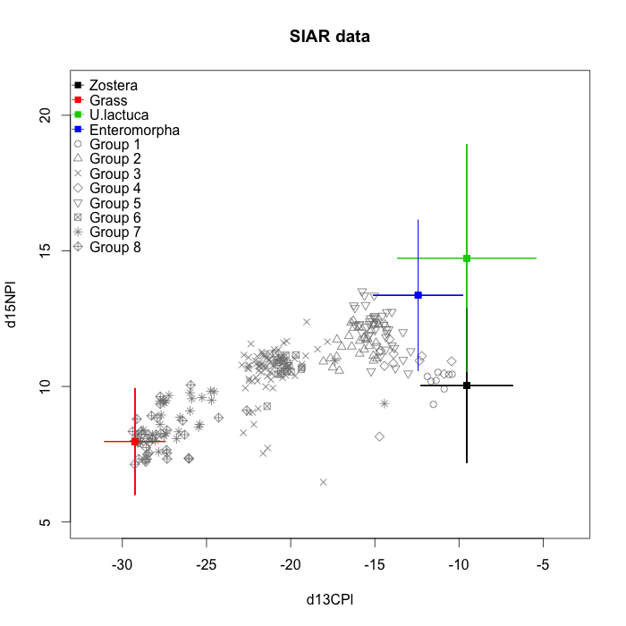
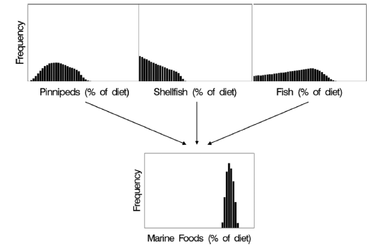

## Basic Mixing Model Assumptions

> - All sources are known
> - Source means are known
> - TEFs are known

## Additional Biological Assumptions

> - Consumer tissue sampled at appropriate time relative to sources
> - Consumer is at equilibrium with their food
> - TEF is a fair reflection of consumer physiology
    - fasting
    - high carbon / nitrogen diets
    - reproduction

## A priori questions - 1
Use prior knowledge to identify questions

## Consider diet - 2
Consider what is known about the animal's diet

## Sample collection - 3

## Enrichment factors - 4
Use appropriate diet-tissue discrimination factors

## Plot your data - 5
- biplot here
- mention Fry's graphical concerns

## Include all sources in an informed way - 6

- ?????

## Consider grouping sources - 7

- we will come to this later in the course

## Concentration and routing - 8
- isotopic concentration differs among sources (IsoConc)
- add isoconc warped plot
- mention routing

## Incorporate uncertainty - 9
- consider and incorporate uncertainty

## Report distributions of results - 10
- credible intervals

## Limitations - 11
- stuff
- more stuff

## New horizons - 12
- future developments

